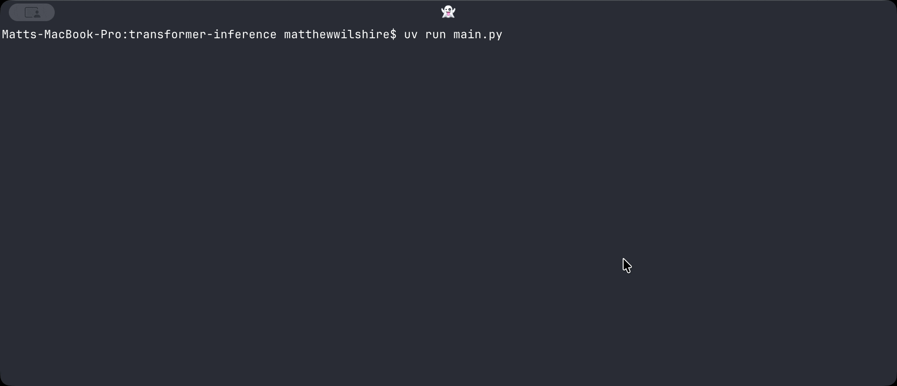

# transformer-inference
Transformer inference from scratch using GPT2 weights. (for learning purposes)

# Note
This project is for learning how transformers work, specifically the decoder architecture used in LLMs. Nothing here is optimised for speed and that's intentional - e.g attention heads are processed one at a time in a loop rather than as a single batched matrix multiply to make it easier to follow what each head is exactly doing.

**TL;DR:** clarity over performance - every operation is written to be read, not to be fast.

# How to use

Install dependencies:
```
uv sync
```

Export the GPT-2 weights:
```
uv run gpt2_export.py
```
This downloads GPT-2 and saves every layer's weights and biases as raw f32 contigous arrays in `./gpt2_weights/` as `.bin` files.


Run main.py

```
uv run main.py
```


